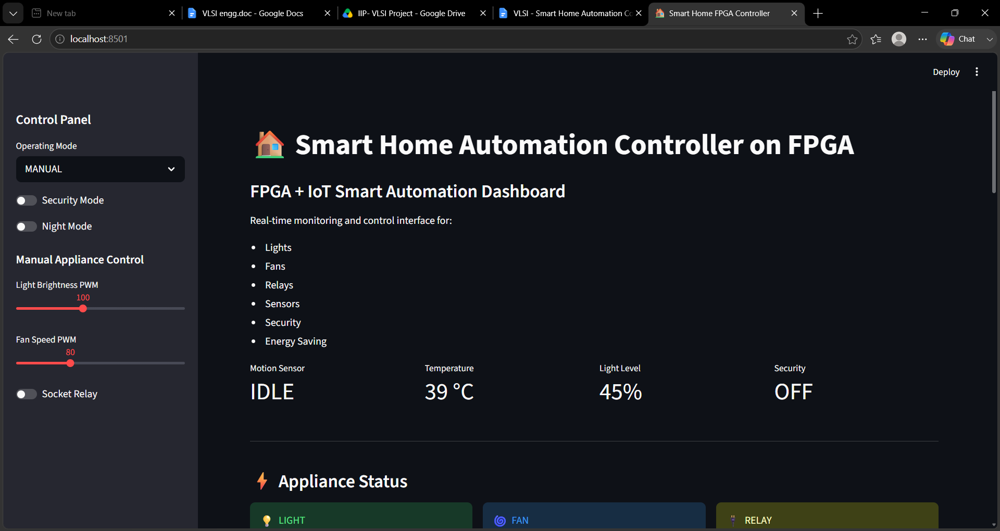
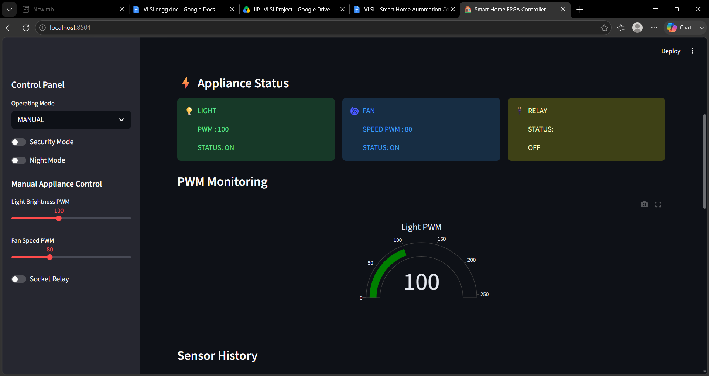
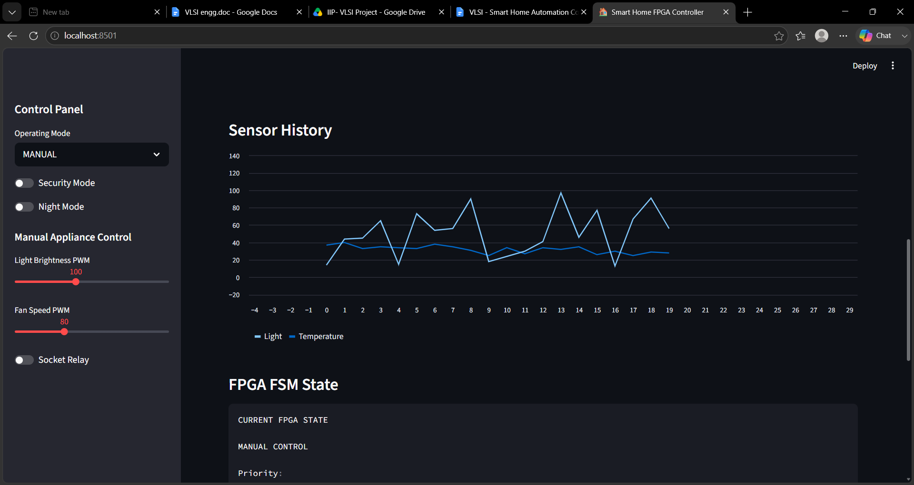
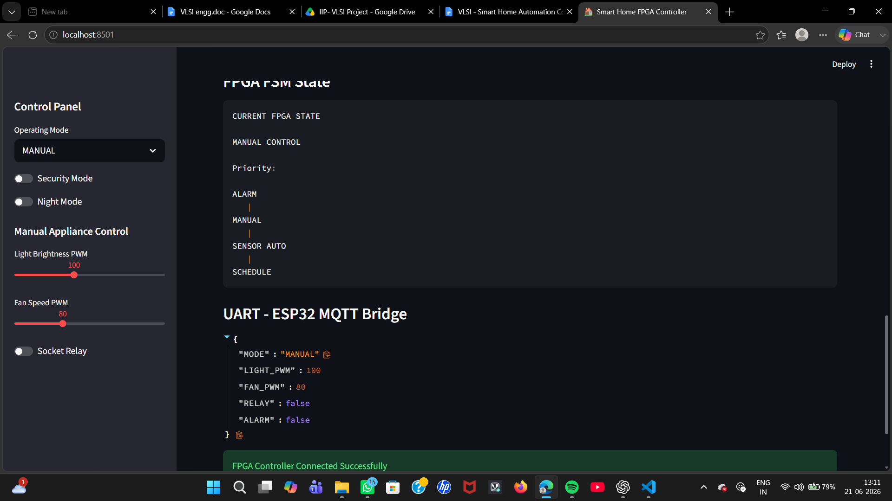
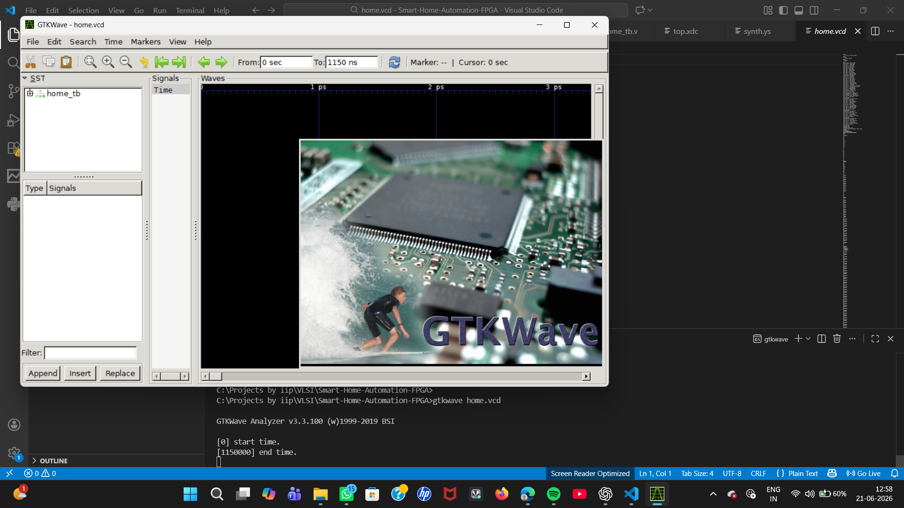
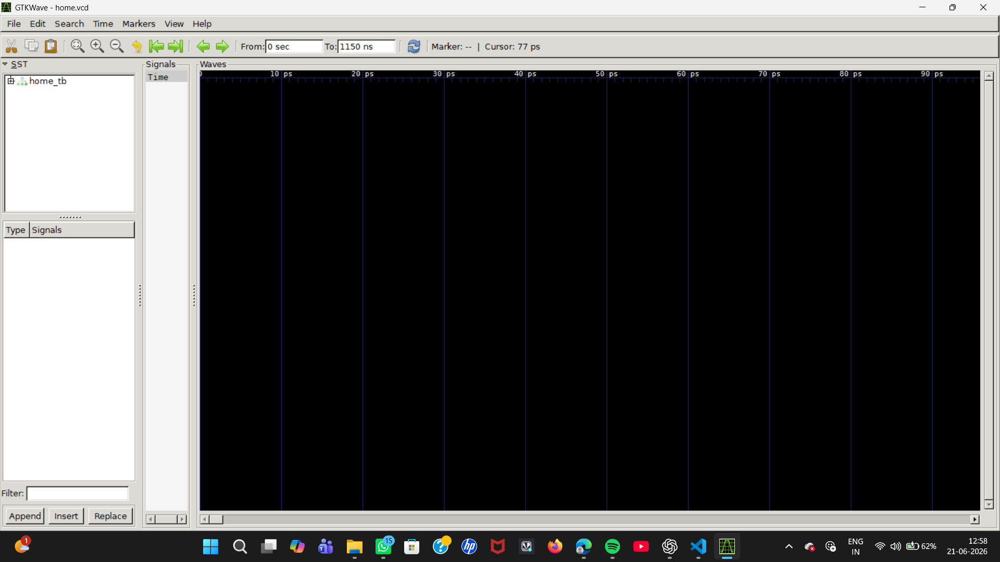
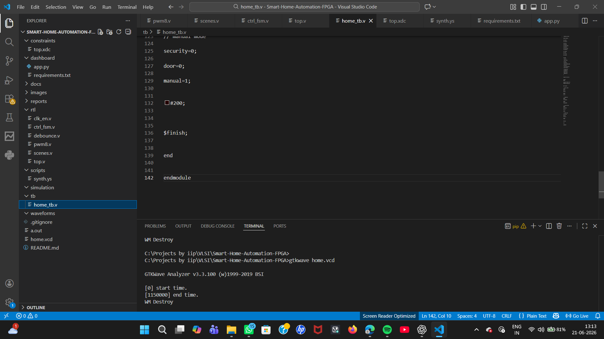

# 🏠 Smart Home Automation Controller on FPGA

## 📌 Project Overview

Smart Home Automation Controller on FPGA is a VLSI-based digital control system designed to automate home appliances using FPGA hardware logic.

The project implements:

- Sensor-based automation
- PWM based light dimming
- Fan speed control
- Relay control simulation
- Security alarm system
- Manual override control
- FSM based decision making
- Real-time monitoring dashboard

The FPGA acts as a deterministic real-time automation controller while an external IoT device such as ESP32 can be used for MQTT/Home Assistant connectivity.

---

# 🎯 Objectives

The main objective of this project is to design a scalable FPGA-based smart home controller that can:

✔ Control multiple appliances  
✔ Process sensor inputs  
✔ Perform real-time decision making  
✔ Implement safety priority logic  
✔ Demonstrate RTL design and FPGA concepts  

---

# 🏗️ System Architecture

          Sensors
             |
             |
    -------------------
    |                 |
    |      FPGA       |
    |                 |
    |  FSM Controller |
    |                 |
    -------------------
             |
             |
    PWM / Relay Outputs
             |
             |
      Home Appliances

             |
             |
      Streamlit Dashboard
             |
             |
         IoT Layer
      ESP32 / MQTT Ready
      

---

# ⚙️ Features Implemented

## 💡 Lighting Control

- Automatic light control
- PWM brightness adjustment
- Motion + darkness based activation

## 🌀 Fan Control

- Temperature based activation
- PWM speed control

## 🔐 Security System

- Door monitoring
- Alarm priority logic
- Emergency response

## 🎛 Manual Override

Manual control has higher priority than automation logic.

Priority:
ALARM
|
MANUAL CONTROL
|
SENSOR AUTOMATION
|
DEFAULT MODE

---

# 🧠 VLSI Concepts Used

| Concept | Usage |
|-|-|
| FPGA | Hardware implementation platform |
| Verilog | RTL design |
| FSM | Appliance decision logic |
| PWM | Light/Fan control |
| Clock Enable | Timing generation |
| Sequential Logic | State control |
| Combinational Logic | Decision making |
| Testbench | Verification |
| Waveform Analysis | Simulation checking |

---

# 🛠️ Tools Used

### RTL Design

- Verilog HDL

### Simulation

- Icarus Verilog
- GTKWave

### FPGA Implementation

- Xilinx Vivado

### Dashboard

- Python
- Streamlit
- Plotly

---

# 📂 Project Structure
Smart-Home-Automation-FPGA
│
├── rtl
│ ├── clk_en.v
│ ├── debounce.v
│ ├── pwm8.v
│ ├── scenes.v
│ ├── ctrl_fsm.v
│ └── top.v
│
├── tb
│ └── home_tb.v
│
├── dashboard
│ ├── app.py
│ └── requirements.txt
│
├── constraints
│ └── top.xdc
│
├── scripts
│ └── synth.ys
│
├── images
│
├── waveforms
│
├── reports
│
└── README.md

---

# 🔄 Control Flow

Input Sensors

    ↓

Signal Conditioning

    ↓

FSM Controller

    ↓

Automation Logic

    ↓

PWM / Relay Outputs

    ↓

Dashboard Monitoring

---

# 🖥️ FPGA Dashboard Preview

## Dashboard View 1

## Dashboard View 2

## Dashboard View 3

## Dashboard View 4

---

# 📊 Simulation Results

GTKWave waveform verification:

## Waveform 1

## Waveform 2

## Complete Simulation

---

# 🧪 Verification

The testbench verifies:

✔ Reset operation

✔ Motion detection

✔ Dark environment lighting

✔ Temperature based fan control

✔ Security alarm activation

✔ Manual override priority

Simulation command:

iverilog -g2012 rtl/*.v tb/home_tb.v

vvp a.out

gtkwave home.vcd

---

# 🚀 Future Improvements

- ESP32 MQTT communication
- Home Assistant integration
- Real temperature sensor using I2C
- LDR ADC interface
- LCD display
- EEPROM scene storage
- Power monitoring
- AI based automation

---

# 📚 Learning Outcomes

Through this project:

✔ RTL coding skills improved

✔ FSM design understanding

✔ FPGA workflow experience

✔ Verification methodology learned

✔ Hardware/software co-design concepts explored

---

# 👨‍💻 Author

**Sanskritika Awasthi**

VLSI | FPGA | Digital Design Project

---

# ⭐ Project Highlights

This project demonstrates how FPGA technology can be used for deterministic, low-latency smart automation systems used in:

- Smart Homes
- Industrial Automation
- Building Management Systems
- IoT Controllers

